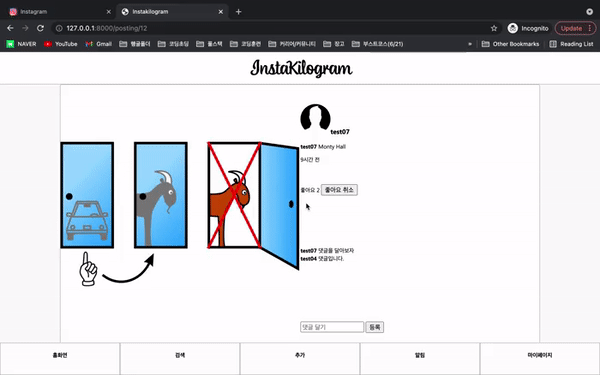

# 인스타킬로그램 프로젝트

## Overview
- Django로 CRUD와 Authentication을 구현하여 인스타그램 주요 기능 따라 만들기
- JWT와 Ajax를 공부할 수 있었다.

## Objective
- Git과 Gitflow 사용, 커밋 기록 남기기에 익숙해지기
- Django Framework로 Authentication과 CRUD 기능 구현
- CBV와 Service Layer 기반 프로그램 짜기
- Ajax를 적용하여 리렌더링 없는 깔끔한 UX 도전

## Features
- 장고 내장 sessionID로 회원가입/로그인
- 타임라인을 비롯한 각 페이지를 로그인된 유저에게만 노출하고, url을 통한 접근 시도시 로그인 뷰로 리다이렉트
- 이미지 기반 포스팅, 댓글과 좋아요
- 유저 프로필 페이지, 유저 간 팔로우 관계 형성
- 마이페이지에서 유저 프로필 편집

## Tech Stack
- HTML / CSS (Scss) / JavaScript
- Python 3.9.1
- Django 3.2.4

## Demonstration
- 타임라인: 팔로우 중인 유저의 게시물이 최근 게시물 순서대로 노출

- Ajax: 좋아요 버튼과 댓글 등록이 리렌더링 없이 반영

